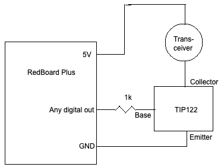

# SwimForce

SwimForce is a swimming analytics system designed to improve how swim practice footage and performance data are captured, organized, and analyzed. The project combines underwater camera feeds, wearable transmitters, and signal processing tools to better identify swimmers and extract meaningful performance data like velocity and turns.

---

## Overview

Traditional swim practice recordings are often messy, hard to sync, and difficult to analyze—especially when multiple swimmers are in the water. SwimForce aims to solve this by:

- Improving identification of swimmers during practice
- Synchronizing underwater camera footage
- Detecting motion patterns and turns more reliably
- Providing structured data for later performance analysis

---
## Documentation

- 📘 Project Writeup / Report:  
  [View PDF](docs/SwimForceReport.pdf)

- 🎤 Slides / Presentation:  
  [View Slides PDF](docs/SwimForce.pdf)

---

## Screenshots

### System Overview

### Underwater Camera Feed

### Signal Detection Output

*(Replace these filenames with your actual image names in the repo.)*

---

## System Components

### 1. Underwater Camera Feeds
- Multiple PoE-connected underwater cameras
- Used to capture continuous swim footage
- Integrated through an NVR/network setup

### 2. Wearable Transmitters (Nano Chips)
- Small transmitters attached to swimmers
- Emit identifiable signals for tracking
- Help differentiate athletes in overlapping lanes

### 3. Signal Detection System
- Built using Python and the NI WaveForms SDK
- Detects transmitter beeps in recorded spectrum data
- Helps align swimmer identity with video timestamps

### 4. Data Processing Pipeline
- Parses recorded signals and camera data
- Attempts to segment swim laps and detect turns
- Organizes footage for later review

---

## Motivation

The main challenge behind SwimForce was the lack of clean, consistent recording and analysis of swim practices. Coaches and athletes often struggle to:

- Match swimmers to specific clips
- Identify exact turn points
- Extract usable performance metrics from raw footage

SwimForce was built to automate and simplify this process.

---

## Tech Stack

- Python
- NI WaveForms SDK
- OpenCV (video processing)
- Networked PoE camera system
- Signal processing / spectrum analysis tools

---

## Current Status

This project is in an active development / proof-of-concept stage. Core components like signal detection and camera integration have been implemented, but full automation of swim analysis is still in progress.

---

## Future Work

- Improve swimmer identification accuracy
- Build a UI dashboard for coaches
- Integrate real-time feedback during practice

---

## 👤 Author

Built by Omar Ebied & Cole Griscavage
